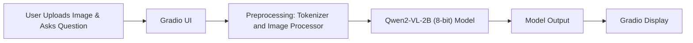

# 🧠 Vision Question Answering using Qwen2-VL 2B

This repository contains an implementation of a **Vision-Language Question Answering** system powered by the **Qwen2-VL 2B** model, loaded in **8-bit precision** for efficient inference, and deployed via a **Gradio** interface.

---

## 📽️ Demo

Experience the model in action:

[](https://www.youtube.com/watch?v=0rbg9O6M0Sk)

---

## 📚 Table of Contents

- [Project Overview](#-project-overview)  
- [Model Details](#-model-details)  
- [System Architecture](#-system-architecture)  
- [Installation](#-installation)  
- [Running the App](#-running-the-app)   

---

## 🚀 Project Overview

This project demonstrates a modern Vision Question Answering (VQA) pipeline. Users upload an image and ask a natural language question; the system retrieves and processes the image, then returns a concise answer.

---

## 🧠 Model Details

- **Model**: Qwen2-VL-2B (2 billion parameters)  
- **Quantization**: 8-bit via `bitsandbytes`  
- **Tokenizer**: QwenTokenizer  
- **Image Processor**: QwenImageProcessor  
- **Interface**: Gradio for image+text input and answer display  

---

## 🛠️ System Architecture



## ⚙️ Installation

1. **Clone the repository**
   ```bash
   git clone https://github.com/your-username/vision-qa-bot.git
   cd vision-qa-bot
